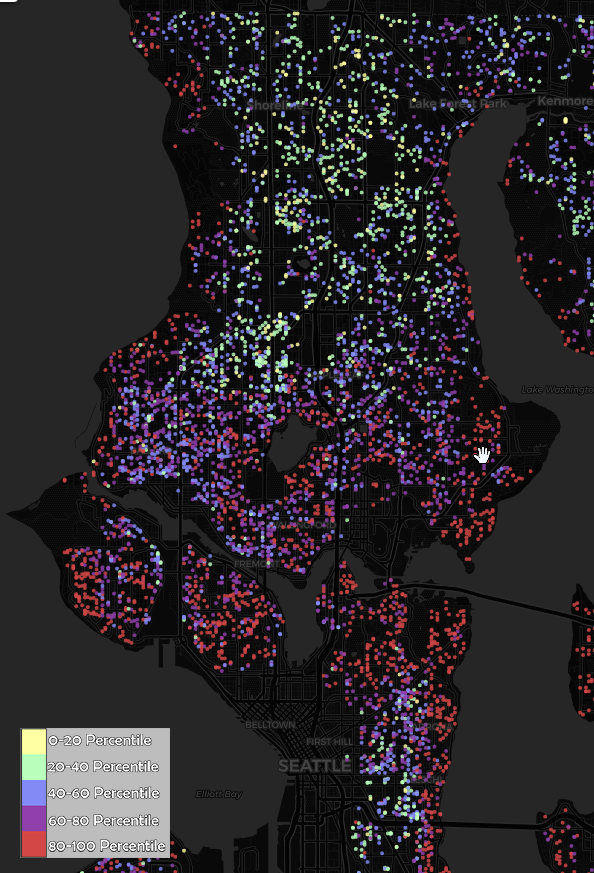

# Machine Learning in the county of Kings

## Overview
---
## Business Problem
---
Our chosen stakeholder is the real-estate agency Keller Williams, who's looking to expand into King County in Washington. They want an analytically supported strategy based on inferential and predictive analysis of the data available on the king county website. Our approach to formulating the business question was to first define our recommended strategy and formulate the business question around it. Accordingly, we formulated three questions that we wanted to answer using our data analysis and based our recommendations on those questions.

We defined our strategy based on the volume metrics of the data and determined that the best way moving forward is to target sellers and buyers of houses that are in highest demand. We chose this strategy because we felt this approach would maximize your future potential revenue. This is based on the notion that a higher quantity of sales would result in more revenues than higher-value sales.

Given our recommended strategy, the business question we formulated is :
What types of houses are in most demand and where are they located?

## Data
---
The data that we used originally came from the King County website, which describes a years worth of sales information starting from May 2014 to May 2015. It contains a good mix of categorical and numerical data. We wanted to focus on variables that corresponded to features that determine the demand of any given house.

Boundary and mapping data was sourced from [https://gis-kingcounty.opendata](https://gis-kingcounty.opendata.arcgis.com/datasets/zipcodes-for-king-county-and-surrounding-area-shorelines-zipcode-shore-area/explore), a repository of publicly available datsets.


## Methodology
---
Python libraries pandas, numpy were used for working with the data, sklearn was our primary modeling tool, and folium was used as a mapping visualizer.

Our approach to data preparation was systematic. We removed some extraneous outliers that would skew our model, dropped columns that that didn't have enough data to incorporate into our model and didn't speak to our business problem. In the end, our model leveraged:
-   ZIP Code used by the United States Postal Service
-   Year when house was built
-   Square footage of living space in the home
-   The square footage of interior housing living space for the nearest 15 neighbors
-   Number of bedrooms and bathrooms
-   Quality of view from the property

To speak directly to our original business question, 
>What types of houses are in most demand and where are they located?

Location as a feature is key. Looking at the data in conjunction with zipcode boundary information we can highlight areas around King County that are in demand.


There are a few zipcodes that have a high volume of listings, however the areas around Green Lake really stand out considering the size of these districts. Most of these zipcodes have over 500 listings in that year alone.

Looking at how properties are priced we can deduce the market demands in a region. Focusing on Green Lake we see that aside from being in demand, homes surrounding it are generally are in the mid to high range.



In fact, per our dataset, the median home price in King County is 450,000$. In comparison, the median price of properties in the surrounding areas is around 550,000$.

>>>Next we can identify property features that drive price.

## Conclusions
---


## Repository Structure
---
```
├── Workspace  
│     ├── Nimeshi
│     │   ├── Notes.md
│     │   └── Untitled.ipynb
│     ├── Saad
│     │   ├── Choropleth testing.ipynb
│     │   ├── Map Testing.ipynb
│     │   ├── Model 7b.ipynb
│     │   ├── Notebook.ipynb
│     │   ├── Notebook_Generalized.pynb
│     │   └── Notes.md
│     └── Zach
│          ├── Models 6-8.ipynb
│          ├── Refined Analysis.ipynb
│          ├── Scrapwork.ipynb
│          ├── Scrapwork2.ipynb
│          └── Notes.md
│
├── data
│     ├── column_names.md
│     ├── kc_house_data.csv
│     └── Zipcodes_for_King_County_and_Surrounding_Area___zipcode_area.geojson
├── images
├── maps
│     ├── PropertiesPentileDisplay.html
│     └── choropeth_zip_salecounts.html
├── README.md
├── *Final Presentation*
└── *Final Notebook*
```

## Authors:
---
- Nimeshi Fernando: 
[LinkedIn](https://www.linkedin.com/in/nimeshi-fernando2019/) |
[GitHub](https://github.com/nishlikefish) |
[Email](nimeshilfernando@gmail.com)
- Saad Saeed: 
[LinkedIn](https://www.linkedin.com/in/saadsaeed85/) |
[GitHub](https://github.com/ssaeed85) |
[Email](mailto:saadsaeed85@gmail.com)
- Zachary Rauch: 
[LinkedIn](https://www.linkedin.com/in/zach-rauch/) |
[GitHub](https://github.com/ZachRauch)|
[Email](zach.rauch0@gmail.com)

## Citations:
---
Images and logo of King County are properties of [kingcounty.gov](https://kingcounty.gov/) \
Zipcode geoJSON: [gis-kingcounty.opendata](https://gis-kingcounty.opendata.arcgis.com/datasets/zipcodes-for-king-county-and-surrounding-area-shorelines-zipcode-shore-area/explore) 

Folium References:\
[python-visualization.github](https://python-visualization.github.io/folium/quickstart.html) \
[towardsdatascience.com/visualizing-data-at-the-zip-code-level-with-folium](https://towardsdatascience.com/visualizing-data-at-the-zip-code-level-with-folium-d07ac983db20) \
[towardsdatascience.com/how-to-step-up-your-folium-choropleth-map-skills](https://towardsdatascience.com/how-to-step-up-your-folium-choropleth-map-skills-17cf6de7c6fe) \
[towardsdatascience.com/folium-and-choropleth-map-from-zero-to-pro](https://towardsdatascience.com/folium-and-choropleth-map-from-zero-to-pro-6127f9e68564) \
[write-geojson-into-a-geojson-file-with-python](https://gis.stackexchange.com/questions/130963/write-geojson-into-a-geojson-file-with-python) 
